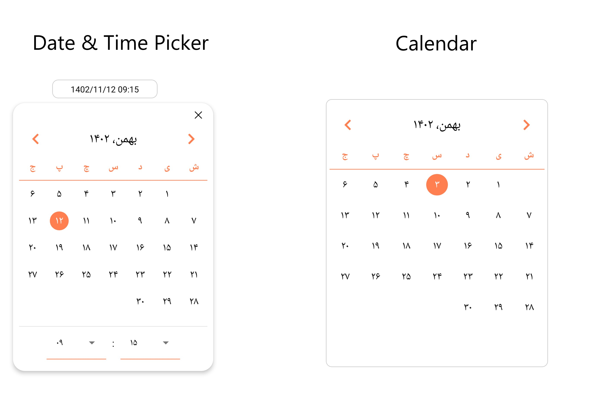

# React Native Jalali Date Picker

A simple, customizable Calendar and Date/Time Picker for React native.
<div align="center">
  
</div>

## Installation

```bash
npm i react-native-jalali-persian-date-picker

# or if you prefer Yarn:
yarn add react-native-jalali-persian-date-picker

```

## Usage

#### Date Picker

Here is a simple example of how to use the `DatePicker` component:

```jsx
import DatePicker from 'react-native-jalali-persian-date-picker';

export default function Example() {
  const [value, setValue] = useState <string | undefined>();

  return (
    <DatePicker value={value} onChange={(date) => setValue(date)} />
  )
}
```
#### Date Picker (Dark)

Here is a simple example of how to have a dark theme for the `DatePicker` component:

```jsx
import DatePicker from 'react-native-jalali-persian-date-picker';

export default function Example() {
  const [value, setValue] = useState <string | undefined>();

  return (
    <DatePicker style={{ backgroundColor: '#161616' }} selectTimeDropdownIconColor={'white'}
                eachMonthTextStyle={{ color: 'white' }} eachYearTextStyle={{ color: 'white' }}
                selectTimePickerItemStyle={{ color: 'white', backgroundColor: '#161616' }}
                datePickerDismissIconColor={'white'} yearMonthTextStyle={{ color: 'white' }}
                datePickerModalStyle={{ backgroundColor: '#161616' }} dayTextColor={'#fff'}
                value={value} onChange={(date) => setValue(date)} />
  );
}
```
#### Calendar

Here is a simple example of how to use the `Calendar` component:

```jsx
import { Calendar } from 'react-native-jalali-persian-date-picker';

export default function Example() {
  const [value, setValue] = useState < string | undefined > ();

  return (
    <Calendar value={value} style={styles.calendar} onChange={(date) => setValue(date)} />
  )
}
const styles = StyleSheet.create({
  calendar: {
    borderColor: '#ccc',
    borderWidth: 1,
    margin: 10,
    height: 450,
    paddingVertical: 10,
    paddingHorizontal: 5,
    borderRadius: 10,
  }
});
```

#### Time Picker

You can include a time picker by adding the `isShowSelectTime` prop to both the Calendar and DatePicker components.

```jsx
import DatePicker from 'react-native-jalali-persian-date-picker';

export default function Example() {
  const [value, setValue] = useState < string | undefined > ();

  return (
    <DatePicker isShowSelectTime={true} value={value} onChange={(date) => setValue(date)} />
  )
}
```

## Available props

|            Prop             |                                Default                                |                     Type                     | Availability (DatePicker/ Calendar) |
|:---------------------------:|:---------------------------------------------------------------------:|:--------------------------------------------:|:-----------------------------------:|
|            style            |                    see [`Props.js`](src/props.js)                     |                 `ViewStyle`                  |                both                 |
|            value            |                                 today                                 |                   `string`                   |                both                 |
|      isShowSelectTime       |                                 false                                 |                  `boolean`                   |                both                 |
|       showMonthLabel        |                                 false                                 |                  `boolean`                   |                both                 |
|        dateSeparator        |                                  `/`                                  |                   `string`                   |                both                 |
|           minDate           |                               last year                               |                   `string`                   |                both                 |
|           maxDate           |                               next year                               |                   `string`                   |                both                 |
|          onChange           |                       date => console.log(date)                       |                  `Function`                  |                both                 |
|    headerContainerStyle     |                    see [`Props.js`](src/props.js)                     |                 `ViewStyle`                  |                both                 |
|      yearMonthBoxStyle      |                    see [`Props.js`](src/props.js)                     |                 `ViewStyle`                  |                both                 |
|     yearMonthTextStyle      |                   { fontSize: 22, color: 'black' }                    |                 `TextStyle`                  |                both                 |
|     iconContainerStyle      |                    see [`Props.js`](src/props.js)                     |                 `ViewStyle`                  |                both                 |
|          backIcon           |                    see [`Props.js`](src/props.js)                     |    `ImageSourcePropType`  or `undefined`     |                both                 |
|        backIconStyle        |                    see [`Props.js`](src/props.js)                     |                 `ImageStyle`                 |                both                 |
|          nextIcon           |                    see [`Props.js`](src/props.js)                     | `ImageSourcePropType`         or `undefined` |                both                 |
|        nextIconStyle        |                    see [`Props.js`](src/props.js)                     |                 `ImageStyle`                 |                both                 |
|  selectTimeContainerStyle   |                    see [`Props.js`](src/props.js)                     |                 `ViewStyle`                  |                both                 |
|    selectTimePickerStyle    |                    see [`Props.js`](src/props.js)                     |                 `ViewStyle`                  |                both                 |
| selectTimeDropdownIconColor |                                `#000`                                 |                 `ColorValue`                 |                both                 |
|  selectTimePickerItemStyle  |                    see [`Props.js`](src/props.js)                     |                 `TextStyle`                  |                both                 |
|    selectTimePickerMode     |                              'dropdown'                               |            `dialog` or `dropdown`            |                both                 |
|        eachYearStyle        |                    see [`Props.js`](src/props.js)                     |                 `ViewStyle`                  |                both                 |
|    selectedEachYearStyle    |                    see [`Props.js`](src/props.js)                     |                 `ViewStyle`                  |                both                 |
|      eachYearTextStyle      |                           { fontSize: 16 }                            |                 `TextStyle`                  |                both                 |
|  selectedEachYearTextStyle  |          { fontSize: 16, color: 'white',fontWeight: 'bold' }          |                 `TextStyle`                  |                both                 |
|       eachMonthStyle        |                    see [`Props.js`](src/props.js)                     |                 `ViewStyle`                  |                both                 |
|   selectedEachMonthStyle    |                    see [`Props.js`](src/props.js)                     |                 `ViewStyle`                  |                both                 |
|     eachMonthTextStyle      |                           { fontSize: 16 }                            |                 `TextStyle`                  |                both                 |
| selectedEachMonthTextStyle  |          { fontSize: 16, color: 'white',fontWeight: 'bold' }          |                 `TextStyle`                  |                both                 |
|   weekdaysContainerStyle    |                    see [`Props.js`](src/props.js)                     |                 `ViewStyle`                  |                both                 |
|        weekdayStyle         |                    see [`Props.js`](src/props.js)                     |                 `ViewStyle`                  |                both                 |
|      weekdayTextStyle       | { fontSize: 16, color: 'coral', marginBottom: 5, fontWeight: 'bold' } |                 `TextStyle`                  |                both                 |
|          dayStyle           |                    see [`Props.js`](src/props.js)                     |                 `ViewStyle`                  |                both                 |
|      selectedDayStyle       |                    see [`Props.js`](src/props.js)                     |                 `ViewStyle`                  |                both                 |
|      selectedDayColor       |                                `coral`                                |                   `string`                   |                both                 |
|        dayTextStyle         |                           { fontSize: 18 }                            |                 `TextStyle`                  |                both                 |
|    selectedDayTextColor     |                               `#FFFFFF`                               |                   `string`                   |                both                 |
|        dayTextColor         |                               `#111111`                               |                   `string`                   |                both                 |
|      disabledTextColor      |                               `#999999`                               |                   `string`                   |                both                 |
|    datePickerModalStyle     |                                                                       |                 `ViewStyle`                  |             DatePicker              |
| datePickerDismissIconColor  |                                `#000`                                 |                 `ColorValue`                 |             DatePicker              |
|         renderItem          |                                                                       |                  `Element`                   |             DatePicker              |

## Example

Take a look at [example](example):

```bash
git clone https://github.com/realmahd1/react-native-jalali-persian-date-picker

cd example

yarn

react-native run-android

# OR

react-native run-ios
```

## Contributing

See the [contributing guide](CONTRIBUTING.md) to learn how to contribute to the repository and the development workflow.

## License

MIT
